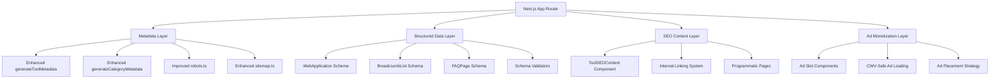

# Design Document: SEO Growth & Monetization System

## Overview

This design document outlines the architecture and implementation strategy for improving SEO performance, organic search traffic, and AdSense revenue for devconverter.dev. The system enhances crawl efficiency, SERP CTR, on-page SEO, structured data coverage, user engagement signals, and ad placement while maintaining Core Web Vitals compliance and following Google policies.

The design follows a modular approach with reusable components, utility functions, and configuration-driven implementations. All changes are realistic, implementable within the existing Next.js App Router architecture, and prioritize both user experience and search engine optimization.

## Architecture

### High-Level Architecture



### Component Hierarchy

```
app/
├── layout.tsx (Enhanced metadata)
├── robots.ts (Fixed asset blocking)
├── sitemap.ts (Enhanced with stable dates)
├── [slug]/page.tsx (Enhanced with SEO content)
└── programmatic/
    ├── [converter]/page.tsx (New)
    └── mime/[extension]/page.tsx (New)

components/
├── seo/
│   ├── ToolSEOContent.tsx (New - Server Component)
│   ├── BreadcrumbSchema.tsx (New)
│   ├── FAQSchema.tsx (New)
│   └── enhanced-structured-data.tsx (Enhanced)
├── ads/
│   ├── AdSlot.tsx (New)
│   ├── ToolPageAd.tsx (New)
│   └── BlogPageAd.tsx (New)
└── internal-links/
    ├── RelatedToolsLinks.tsx (New)
    └── BlogToolLinks.tsx (New)

lib/
├── seo/
│   ├── metadata.ts (Enhanced)
│   ├── schema-generators.ts (New)
│   ├── schema-validators.ts (New)
│   └── internal-linking.ts (New)
└── ads/
    ├── ad-config.ts (New)
    └── ad-utils.ts (New)
```

## Components and Interfaces

### 1. Enhanced Metadata Generation

#### generateToolMetadata Enhancement

```typescript
interface EnhancedToolMetadata extends Metadata {
  title: string // CTR-optimized with keywords early
  description: string // Includes "Free", "Online", "Instant"
  keywords: string[]
  alternates: {
    canonical: string // Absolute URL
  }
  openGraph: {
    title: string
    description: string
    type: "website"
    siteName: string
    url: string // Absolute URL
    images: Array<{
      url: string // Absolute URL via metadataBase
      width: number
      height: number
      alt: string
    }>
  }
  twitter: {
    card: "summary_large_image"
    title: string
    description: string
    images: string[] // Absolute URLs
    creator: string
  }
  applicationName: string
  authors: Array<{ name: string }>
  creator: string
  publisher: string
  category: string
  robots: {
    index: boolean
    follow: boolean
  }
}
```

**CTR Optimization Template:**
```
Title Format: "[Tool Name] - Free Online [Primary Keyword] | DevConverter"
Description Format: "Free online [tool] - [benefit]. Instant results, no signup required. [Key features]."
```

**Example:**
- Before: "Base64 Encoder & Decoder - DevConverter"
- After: "Base64 Encoder & Decoder - Free Online Base64 Converter | DevConverter"

#### generateCategoryMetadata Enhancement

```typescript
interface EnhancedCategoryMetadata extends Metadata {
  title: string // "[Category] Tools - Free Online Developer Tools"
  description: string // Includes tool count and benefits
  openGraph: OpenGraphMetadata
  twitter: TwitterMetadata
  alternates: { canonical: string }
  category: string
}
```

### 2. Robots.txt Configuration

#### Current Issue
The current robots.ts blocks `/_next/` for all user agents, which may prevent Google from accessing CSS/JS needed for rendering.

#### Fixed Configuration

```typescript
export default function robots(): MetadataRoute.Robots {
  return {
    rules: [
      {
        userAgent: "*",
        allow: "/",
        disallow: ["/api/", "/admin/"],
      },
      {
        userAgent: "Googlebot",
        allow: ["/", "/_next/static/"], // Allow static assets
        disallow: ["/api/", "/admin/"],
      },
    ],
    sitemap: "https://devconverter.dev/sitemap.xml",
    host: "https://devconverter.dev",
  }
}
```

**Rationale:**
- Google recommends allowing CSS/JS for proper rendering
- `/_next/static/` contains built assets needed for page display
- Googlebot gets special rules to ensure full rendering capability
- Other bots still blocked from /_next/ to reduce crawl load

### 3. Enhanced Sitemap

#### Current Issues
1. Uses `new Date()` for every URL, causing "always changed" signals
2. Missing important pages (FAQ, tools listing, categories index)
3. No duplicate URL prevention

#### Enhanced Implementation

```typescript
interface SitemapEntry {
  url: string
  lastModified: Date | string
  changeFrequency: "always" | "hourly" | "daily" | "weekly" | "monthly" | "yearly" | "never"
  priority: number
}

interface SitemapConfig {
  baseUrl: string
  staticPages: Array<{
    path: string
    changeFrequency: SitemapEntry["changeFrequency"]
    priority: number
    lastModified?: Date
  }>
  dynamicContentLastModified: {
    tools: Date
    categories: Date
    blog: Date
  }
}
```

**Stable lastModified Strategy:**
- Static pages: Use build time or manual date
- Tool pages: Use tool registry last update date
- Blog posts: Use actual post.date
- Category pages: Use latest tool update in category
- Tag pages: Use latest post date for that tag

**Additional Pages to Include:**
- `/faq` (if exists)
- `/tools` (if listing page exists)
- `/categories` (index page)
- All programmatic pages

### 4. Structured Data Schemas

#### Enhanced WebApplication Schema

```typescript
interface EnhancedWebApplicationSchema {
  "@context": "https://schema.org"
  "@type": "WebApplication"
  "@id": string // Canonical URL
  name: string // tool.name
  description: string // tool.info.description || tool.description
  url: string // Canonical URL
  image: string // Absolute URL
  applicationCategory: "DeveloperApplication"
  operatingSystem: "Any"
  inLanguage: "en"
  isAccessibleForFree: true // NEW
  featureList: string[] // NEW - from tool.info.features
  offers: {
    "@type": "Offer"
    price: "0"
    priceCurrency: "USD"
    availability: "https://schema.org/InStock"
  }
  creator: {
    "@type": "Organization"
    name: "DevConverter"
    url: "https://devconverter.dev"
  }
  browserRequirements: "Requires JavaScript. Requires HTML5."
  permissions: "No special permissions required"
}
```

#### BreadcrumbList Schema

```typescript
interface BreadcrumbListSchema {
  "@context": "https://schema.org"
  "@type": "BreadcrumbList"
  itemListElement: Array<{
    "@type": "ListItem"
    position: number
    name: string
    item?: string // URL (omit for last item)
  }>
}

// Example for tool page:
// Home > Encoding Tools > Base64 Encoder
{
  "@context": "https://schema.org",
  "@type": "BreadcrumbList",
  "itemListElement": [
    {
      "@type": "ListItem",
      "position": 1,
      "name": "Home",
      "item": "https://devconverter.dev"
    },
    {
      "@type": "ListItem",
      "position": 2,
      "name": "Encoding Tools",
      "item": "https://devconverter.dev/categories/encoding"
    },
    {
      "@type": "ListItem",
      "position": 3,
      "name": "Base64 Encoder & Decoder"
    }
  ]
}
```

#### FAQPage Schema

```typescript
interface FAQPageSchema {
  "@context": "https://schema.org"
  "@type": "FAQPage"
  mainEntity: Array<{
    "@type": "Question"
    name: string // question
    acceptedAnswer: {
      "@type": "Answer"
      text: string // answer (plain text, no HTML)
    }
  }>
}

// Generation function
function generateFAQSchema(faqs: ToolFAQ[]): FAQPageSchema {
  return {
    "@context": "https://schema.org",
    "@type": "FAQPage",
    mainEntity: faqs.map(faq => ({
      "@type": "Question",
      name: faq.question,
      acceptedAnswer: {
        "@type": "Answer",
        text: faq.answer
      }
    }))
  }
}
```

### 5. ToolSEOContent Server Component

#### Component Interface

```typescript
interface ToolSEOContentProps {
  tool: Tool
  category?: Category
}

// Component structure
export function ToolSEOContent({ tool, category }: ToolSEOContentProps) {
  return (
    <div className="seo-content">
      {/* H1 - Primary keyword */}
      <h1>{tool.name}</h1>
      
      {/* What is section */}
      <section>
        <h2>What is {extractKeyword(tool.name)}?</h2>
        <p>{tool.info?.description || tool.description}</p>
      </section>
      
      {/* How to use section */}
      {tool.info?.howToUse && (
        <section>
          <h2>How to Use {extractKeyword(tool.name)}</h2>
          <ol>
            {tool.info.howToUse.map((step, i) => (
              <li key={i}>{step}</li>
            ))}
          </ol>
        </section>
      )}
      
      {/* Examples section */}
      {tool.examples && tool.examples.length > 0 && (
        <section>
          <h2>Examples</h2>
          {tool.examples.map((example, i) => (
            <div key={i}>
              <h3>{example.title}</h3>
              <p>{example.description}</p>
              <pre><code>{example.input}</code></pre>
            </div>
          ))}
        </section>
      )}
      
      {/* Use cases section */}
      {tool.info?.useCases && (
        <section>
          <h2>Common Use Cases</h2>
          <ul>
            {tool.info.useCases.map((useCase, i) => (
              <li key={i}>{useCase}</li>
            ))}
          </ul>
        </section>
      )}
      
      {/* Features section */}
      {tool.info?.features && (
        <section>
          <h2>Key Features</h2>
          <ul>
            {tool.info.features.map((feature, i) => (
              <li key={i}>{feature}</li>
            ))}
          </ul>
        </section>
      )}
      
      {/* Related tools with internal links */}
      {tool.relatedTools && tool.relatedTools.length > 0 && (
        <section>
          <h2>Related Tools</h2>
          <RelatedToolsLinks toolIds={tool.relatedTools} />
        </section>
      )}
      
      {/* FAQ section */}
      {tool.faq && tool.faq.length > 0 && (
        <section>
          <h2>Frequently Asked Questions</h2>
          <FAQ items={tool.faq} />
        </section>
      )}
    </div>
  )
}
```

### 6. Internal Linking System

#### Tool-to-Tool Links

```typescript
interface RelatedToolsLinksProps {
  toolIds: string[]
  context?: "sidebar" | "content" | "faq"
}

// Generates descriptive anchor text
function generateAnchorText(tool: Tool, context: string): string {
  const templates = {
    sidebar: tool.name,
    content: `Learn more about ${tool.name}`,
    faq: `our ${tool.name} tool`
  }
  return templates[context] || tool.name
}
```

#### Blog-to-Tool Links

```typescript
interface BlogToolMapping {
  blogSlug: string
  toolIds: string[]
  anchorContext: string // Where in blog to suggest link
}

// Example mappings
const blogToolMappings: BlogToolMapping[] = [
  {
    blogSlug: "base64-encode-decode-guide",
    toolIds: ["base64-encode-decode", "image-to-base64"],
    anchorContext: "Try our Base64 encoder tool"
  },
  {
    blogSlug: "how-to-decode-jwt-token",
    toolIds: ["jwt-decoder"],
    anchorContext: "Use our JWT decoder"
  }
]
```

#### Tool-to-Blog Links

```typescript
interface ToolBlogMapping {
  toolId: string
  blogSlugs: string[]
  linkText: string
}

// Rendered in ToolSEOContent
function renderBlogLinks(tool: Tool): JSX.Element {
  const relatedBlogs = getRelatedBlogs(tool.id)
  return (
    <div className="related-articles">
      <h3>Learn More</h3>
      <ul>
        {relatedBlogs.map(blog => (
          <li key={blog.slug}>
            <Link href={`/blog/${blog.slug}`}>
              {blog.title}
            </Link>
          </li>
        ))}
      </ul>
    </div>
  )
}
```

### 7. Ad Monetization Components

#### AdSlot Base Component

```typescript
interface AdSlotProps {
  slotId: string
  format: "horizontal" | "vertical" | "rectangle" | "responsive"
  minHeight: number // Reserve space to prevent CLS
  className?: string
  lazy?: boolean
}

export function AdSlot({ slotId, format, minHeight, className, lazy = true }: AdSlotProps) {
  return (
    <div 
      className={`ad-slot ${className}`}
      style={{ minHeight: `${minHeight}px` }}
      data-ad-slot={slotId}
      data-ad-format={format}
    >
      {/* AdSense script injection */}
    </div>
  )
}
```

#### Ad Placement Strategy

```typescript
interface AdPlacementConfig {
  pageType: "tool" | "category" | "blog" | "home"
  slots: Array<{
    position: "top" | "after-intro" | "after-tool" | "sidebar" | "bottom"
    format: AdSlotProps["format"]
    minHeight: number
    priority: number
  }>
}

const toolPageAdConfig: AdPlacementConfig = {
  pageType: "tool",
  slots: [
    {
      position: "after-intro", // After "What is" section
      format: "horizontal",
      minHeight: 90,
      priority: 1
    },
    {
      position: "after-tool", // Below tool output
      format: "rectangle",
      minHeight: 250,
      priority: 2
    },
    {
      position: "sidebar", // Desktop only
      format: "vertical",
      minHeight: 600,
      priority: 3
    }
  ]
}
```

#### CWV-Safe Ad Loading

```typescript
// Lazy load ads after LCP
function useLazyAds() {
  const [shouldLoadAds, setShouldLoadAds] = useState(false)
  
  useEffect(() => {
    // Wait for LCP or 2 seconds, whichever comes first
    const lcpObserver = new PerformanceObserver((list) => {
      const entries = list.getEntries()
      const lastEntry = entries[entries.length - 1]
      if (lastEntry) {
        setShouldLoadAds(true)
      }
    })
    
    lcpObserver.observe({ entryTypes: ['largest-contentful-paint'] })
    
    const timeout = setTimeout(() => setShouldLoadAds(true), 2000)
    
    return () => {
      lcpObserver.disconnect()
      clearTimeout(timeout)
    }
  }, [])
  
  return shouldLoadAds
}
```

### 8. Programmatic SEO Pages

#### Converter Pair Pages

```typescript
// app/convert/[pair]/page.tsx
interface ConverterPairPageProps {
  params: Promise<{ pair: string }> // e.g., "hex-to-rgb"
}

// Generate static params for common pairs
export async function generateStaticParams() {
  const pairs = [
    "hex-to-rgb",
    "rgb-to-hex",
    "hex-to-hsl",
    "hsl-to-hex",
    "unix-to-iso",
    "iso-to-unix",
    // ... more pairs
  ]
  
  return pairs.map(pair => ({ pair }))
}

// Metadata generation
export async function generateMetadata({ params }: ConverterPairPageProps): Promise<Metadata> {
  const { pair } = await params
  const [from, to] = pair.split("-to-")
  
  return {
    title: `${from.toUpperCase()} to ${to.toUpperCase()} Converter - Free Online Tool`,
    description: `Convert ${from.toUpperCase()} to ${to.toUpperCase()} instantly. Free online converter with examples and explanations.`,
    alternates: {
      canonical: `https://devconverter.dev/convert/${pair}`
    }
  }
}
```

#### MIME Type Lookup Pages

```typescript
// app/mime/[extension]/page.tsx
interface MimePageProps {
  params: Promise<{ extension: string }> // e.g., "pdf"
}

// Generate static params for common extensions
export async function generateStaticParams() {
  const extensions = [
    "pdf", "jpg", "png", "gif", "svg", "json", "xml", "csv",
    "mp4", "mp3", "zip", "txt", "html", "css", "js", "ts"
    // ... more extensions
  ]
  
  return extensions.map(extension => ({ extension }))
}

// Metadata generation
export async function generateMetadata({ params }: MimePageProps): Promise<Metadata> {
  const { extension } = await params
  const mimeType = getMimeType(extension)
  
  return {
    title: `MIME Type for .${extension} Files - ${mimeType}`,
    description: `The MIME type for .${extension} files is ${mimeType}. Learn about ${extension} file format, usage, and compatibility.`,
    alternates: {
      canonical: `https://devconverter.dev/mime/${extension}`
    }
  }
}
```

## Data Models

### Enhanced Tool Type

```typescript
interface Tool {
  // ... existing fields
  info?: ToolInfo
  faq: ToolFAQ[]
  relatedTools?: string[]
  relatedBlogs?: string[] // NEW - blog slugs
  seo?: {
    primaryKeyword: string // NEW - for H1 optimization
    secondaryKeywords: string[] // NEW - for content optimization
    lastContentUpdate: Date // NEW - for sitemap
  }
}
```

### Internal Linking Configuration

```typescript
interface InternalLinkingConfig {
  toolToTool: Map<string, string[]> // toolId -> related toolIds
  toolToBlog: Map<string, string[]> // toolId -> blog slugs
  blogToTool: Map<string, string[]> // blog slug -> toolIds
}
```

### Ad Configuration

```typescript
interface AdConfig {
  enabled: boolean
  publisherId: string
  slots: {
    [key: string]: {
      id: string
      format: string
      minHeight: number
    }
  }
  placement: {
    tool: AdPlacementConfig
    category: AdPlacementConfig
    blog: AdPlacementConfig
    home: AdPlacementConfig
  }
  cwvThresholds: {
    maxCLS: number // 0.1
    maxLCPDelay: number // 2500ms
  }
}
```

## Correctness Properties

*A property is a characteristic or behavior that should hold true across all valid executions of a system—essentially, a formal statement about what the system should do. Properties serve as the bridge between human-readable specifications and machine-verifiable correctness guarantees.*


### Property 1: Robots.txt allows essential rendering assets
*For any* CSS, JavaScript, or image asset required for page rendering, the robots.txt configuration should not block access to that asset path.
**Validates: Requirements 1.1, 1.9, 8.6**

### Property 2: Sitemap completeness
*For any* tool, category, blog post, or important static page in the system, the generated sitemap should contain an entry with the correct URL format.
**Validates: Requirements 1.4, 1.5, 8.5**

### Property 3: Sitemap URL uniqueness
*For any* generated sitemap, all URLs should be unique with no duplicates or inconsistent trailing slash handling.
**Validates: Requirements 1.6**

### Property 4: Sitemap date stability
*For any* content that hasn't changed, generating the sitemap multiple times should produce the same lastModified date.
**Validates: Requirements 1.8**

### Property 5: Canonical URL presence
*For any* indexable page, the generated metadata should include an absolute canonical URL.
**Validates: Requirements 1.7, 2.4**

### Property 6: Metadata keyword optimization
*For any* tool or category page, the generated title should include primary keywords in the first 50% of the title string.
**Validates: Requirements 2.1**

### Property 7: CTR-optimizing terms in titles
*For any* tool or category page, the generated title should contain at least one CTR-optimizing term from the set: "Free", "Online", "Instant", "No Signup", "Fast", "Easy".
**Validates: Requirements 2.2, 2.6**

### Property 8: Absolute URLs in metadata
*For any* generated metadata with image fields (Open Graph, Twitter), all image URLs should be absolute (starting with http:// or https://).
**Validates: Requirements 2.3, 2.8**

### Property 9: Metadata consistency
*For any* page, the Open Graph title and description should be consistent with (or derived from) the main page title and description.
**Validates: Requirements 2.5**

### Property 10: WebApplication schema presence
*For any* tool page, the HTML output should contain a valid WebApplication JSON-LD schema with required fields (@context, @type, name, url).
**Validates: Requirements 3.1**

### Property 11: Schema conditional fields
*For any* tool with info.description or info.features, the WebApplication schema should include those fields as description and featureList respectively.
**Validates: Requirements 3.2, 3.4**

### Property 12: Schema accessibility field
*For any* WebApplication schema, it should include the field isAccessibleForFree set to true.
**Validates: Requirements 3.3**

### Property 13: BreadcrumbList schema presence
*For any* tool page, the HTML output should contain a valid BreadcrumbList JSON-LD schema showing the navigation hierarchy from home to the current page.
**Validates: Requirements 3.5**

### Property 14: Conditional FAQ schema
*For any* tool page where FAQ content is visible in the HTML, a valid FAQPage JSON-LD schema should be present containing all FAQ items.
**Validates: Requirements 3.6, 9.1, 9.2, 9.3**

### Property 15: Schema URL absoluteness
*For any* JSON-LD schema with image or URL fields, all URLs should be absolute.
**Validates: Requirements 3.7**

### Property 16: Schema structural validity
*For any* JSON-LD schema in the HTML output, it should have valid @context and @type fields, and all fields should match their expected types according to schema.org specifications.
**Validates: Requirements 3.8, 3.9, 8.4, 9.4**

### Property 17: FAQ schema text sanitization
*For any* FAQPage schema, the answer text should not contain HTML entities or markup that would break JSON-LD validation.
**Validates: Requirements 9.5**

### Property 18: Single H1 per page
*For any* tool page HTML output, there should be exactly one H1 heading containing the tool name or primary keyword.
**Validates: Requirements 4.1**

### Property 19: Required H2 sections
*For any* tool page with info fields, the HTML should contain H2 headings for "What is", "How to use", "Examples", "Use Cases", and "FAQ" sections where the corresponding data exists.
**Validates: Requirements 4.2**

### Property 20: Server-side rendering of SEO content
*For any* tool page, the initial HTML (before JavaScript execution) should contain all SEO content including headings, descriptions, examples, and FAQ.
**Validates: Requirements 4.3, 4.8, 10.5**

### Property 21: Content generation from tool data
*For any* tool with info.description, info.howToUse, info.useCases, or info.features, the HTML should contain crawlable content derived from these fields.
**Validates: Requirements 4.4**

### Property 22: Conditional content rendering
*For any* tool with examples or FAQ data, the HTML should render that content with proper semantic markup.
**Validates: Requirements 4.5, 4.6**

### Property 23: Related tools internal linking
*For any* tool with relatedTools defined, the HTML should contain internal links to those tools with descriptive anchor text including keywords.
**Validates: Requirements 4.7, 5.1, 5.4, 10.4**

### Property 24: Bidirectional blog-tool linking
*For any* tool-blog mapping, if tool A links to blog B, then blog B should link back to tool A, and vice versa.
**Validates: Requirements 5.2, 5.3, 5.6**

### Property 25: Ad slot CLS prevention
*For any* ad slot component, it should have a CSS min-height property set to reserve space before the ad loads.
**Validates: Requirements 6.1**

### Property 26: Ad lazy loading
*For any* ad slot, the ad script should not execute until after the initial page load or LCP event.
**Validates: Requirements 6.2**

### Property 27: Ad placement strategy differentiation
*For any* page type (tool, category, blog), the ad placement configuration should be different and appropriate for that page type.
**Validates: Requirements 6.3, 6.4, 6.5**

### Property 28: Mobile sticky ad CLS safety
*For any* sticky bottom banner ad on mobile, it should either not exist or have proper height reservation to prevent CLS.
**Validates: Requirements 6.7**

### Property 29: Programmatic page generation
*For any* converter pair, MIME extension, or timestamp conversion in the configuration, the system should be able to generate a valid page with unique content.
**Validates: Requirements 7.1, 7.2, 7.3, 7.4**

### Property 30: Programmatic page SEO completeness
*For any* programmatic page, it should have valid schema, a canonical URL, and an entry in the sitemap.
**Validates: Requirements 7.5, 7.6, 7.7**

### Property 31: Programmatic page uniqueness
*For any* two different programmatic pages, the content should be unique and canonical URLs should prevent duplicate content issues.
**Validates: Requirements 7.8**

### Property 32: ToolSEOContent component completeness
*For any* tool passed to the ToolSEOContent component, it should render all available sections (description, how-to, examples, use cases, features, related tools, FAQ) with proper heading hierarchy.
**Validates: Requirements 10.2, 10.3, 10.6**

## Error Handling

### Metadata Generation Errors

**Missing Tool Data:**
- If tool.info is undefined, fall back to tool.description
- If tool.metadata is incomplete, generate default CTR-optimized metadata
- Log warnings for missing SEO-critical fields

**Invalid URLs:**
- Validate all URLs before adding to metadata or schemas
- Ensure metadataBase is set correctly in root layout
- Throw build-time errors for invalid canonical URLs

### Schema Generation Errors

**Invalid Schema Data:**
- Validate schema objects against schema.org types before rendering
- Sanitize text fields to remove HTML entities and invalid characters
- Skip optional schema fields if data is malformed
- Always include required fields (@context, @type)

**FAQ Schema Issues:**
- If FAQ answers contain HTML, strip tags before adding to schema
- If FAQ array is empty, don't generate FAQPage schema
- Validate that questions and answers are non-empty strings

### Sitemap Generation Errors

**Missing Content:**
- If a tool or page is missing required data, log error but continue sitemap generation
- Ensure sitemap always includes at least the homepage
- Handle async content loading errors gracefully

**Date Handling:**
- If lastModified date is invalid, use build time as fallback
- Ensure dates are in ISO 8601 format
- Handle timezone conversions correctly

### Ad Loading Errors

**Ad Script Failures:**
- Wrap ad loading in try-catch to prevent page crashes
- If ad fails to load, collapse the reserved space after timeout
- Log ad errors for monitoring but don't break page functionality

**CLS Issues:**
- Monitor CLS metrics and alert if threshold exceeded
- Provide fallback dimensions if ad size is unknown
- Disable problematic ad slots automatically if CLS > 0.1

### Internal Linking Errors

**Missing Related Content:**
- If related tool doesn't exist, skip the link
- If blog post is deleted, remove from tool-blog mappings
- Validate all internal links at build time

**Broken Mappings:**
- Validate bidirectional mappings are consistent
- Log warnings for one-way mappings
- Provide admin interface to fix broken links

## Testing Strategy

### Dual Testing Approach

This system requires both unit tests and property-based tests for comprehensive coverage:

**Unit Tests** focus on:
- Specific metadata examples (e.g., "Base64 Encoder" generates expected title)
- Edge cases (missing tool.info, empty FAQ arrays, invalid URLs)
- Error conditions (malformed schema data, broken links)
- Integration points (component rendering, schema injection)

**Property-Based Tests** focus on:
- Universal properties across all tools (every tool has valid metadata)
- Schema validation across all possible tool configurations
- URL format consistency across all pages
- Content generation rules for any tool data

### Property-Based Testing Configuration

**Library:** fast-check (TypeScript/JavaScript property-based testing library)

**Test Configuration:**
- Minimum 100 iterations per property test
- Each test tagged with: `Feature: seo-growth-monetization, Property {number}: {property_text}`
- Use custom generators for Tool, Category, and BlogPost types
- Seed tests for reproducibility

**Example Property Test Structure:**
```typescript
import fc from 'fast-check'

// Feature: seo-growth-monetization, Property 10: WebApplication schema presence
test('every tool page has valid WebApplication schema', () => {
  fc.assert(
    fc.property(
      toolArbitrary, // Generator for random Tool objects
      (tool) => {
        const html = renderToolPage(tool)
        const schemas = extractJSONLD(html)
        const webAppSchema = schemas.find(s => s['@type'] === 'WebApplication')
        
        expect(webAppSchema).toBeDefined()
        expect(webAppSchema['@context']).toBe('https://schema.org')
        expect(webAppSchema.name).toBe(tool.name)
        expect(webAppSchema.url).toMatch(/^https:\/\//)
      }
    ),
    { numRuns: 100 }
  )
})
```

### Test Generators

**Tool Generator:**
```typescript
const toolArbitrary = fc.record({
  id: fc.string(),
  slug: fc.string().map(s => s.toLowerCase().replace(/[^a-z0-9-]/g, '-')),
  name: fc.string({ minLength: 5, maxLength: 50 }),
  description: fc.string({ minLength: 20, maxLength: 200 }),
  category: fc.constantFrom('encoding', 'json', 'security', 'text', 'time'),
  keywords: fc.array(fc.string(), { minLength: 3, maxLength: 10 }),
  metadata: fc.record({
    title: fc.string({ minLength: 10, maxLength: 60 }),
    description: fc.string({ minLength: 50, maxLength: 160 }),
    keywords: fc.array(fc.string(), { minLength: 5, maxLength: 15 })
  }),
  info: fc.option(fc.record({
    description: fc.string({ minLength: 100, maxLength: 500 }),
    howToUse: fc.array(fc.string(), { minLength: 3, maxLength: 7 }),
    useCases: fc.array(fc.string(), { minLength: 3, maxLength: 10 }),
    features: fc.array(fc.string(), { minLength: 3, maxLength: 8 })
  })),
  faq: fc.array(fc.record({
    question: fc.string({ minLength: 10, maxLength: 100 }),
    answer: fc.string({ minLength: 20, maxLength: 300 })
  }), { maxLength: 10 }),
  relatedTools: fc.option(fc.array(fc.string(), { maxLength: 5 }))
})
```

### Unit Test Examples

**Metadata Generation:**
```typescript
describe('generateToolMetadata', () => {
  it('includes CTR-optimizing terms in title', () => {
    const tool = createMockTool({ name: 'Base64 Encoder' })
    const metadata = generateToolMetadata(tool)
    
    const ctrTerms = ['Free', 'Online', 'Instant', 'No Signup']
    const hasOptimizingTerm = ctrTerms.some(term => 
      metadata.title.includes(term)
    )
    
    expect(hasOptimizingTerm).toBe(true)
  })
  
  it('sets absolute canonical URL', () => {
    const tool = createMockTool({ slug: 'test-tool' })
    const metadata = generateToolMetadata(tool)
    
    expect(metadata.alternates.canonical).toMatch(/^https:\/\//)
    expect(metadata.alternates.canonical).toContain('test-tool')
  })
  
  it('handles missing tool.info gracefully', () => {
    const tool = createMockTool({ info: undefined })
    const metadata = generateToolMetadata(tool)
    
    expect(metadata.title).toBeDefined()
    expect(metadata.description).toBeDefined()
  })
})
```

**Schema Generation:**
```typescript
describe('generateWebApplicationSchema', () => {
  it('includes isAccessibleForFree field', () => {
    const tool = createMockTool()
    const schema = generateWebApplicationSchema(tool)
    
    expect(schema.isAccessibleForFree).toBe(true)
  })
  
  it('includes featureList when tool.info.features exists', () => {
    const tool = createMockTool({
      info: {
        features: ['Feature 1', 'Feature 2', 'Feature 3']
      }
    })
    const schema = generateWebApplicationSchema(tool)
    
    expect(schema.featureList).toEqual(['Feature 1', 'Feature 2', 'Feature 3'])
  })
  
  it('uses tool.info.description when available', () => {
    const tool = createMockTool({
      description: 'Short description',
      info: {
        description: 'Long detailed description for SEO'
      }
    })
    const schema = generateWebApplicationSchema(tool)
    
    expect(schema.description).toBe('Long detailed description for SEO')
  })
})
```

**Robots.txt Validation:**
```typescript
describe('robots.ts', () => {
  it('allows CSS and JS assets for Googlebot', () => {
    const robotsConfig = robots()
    const googlebotRule = robotsConfig.rules.find(
      r => r.userAgent === 'Googlebot'
    )
    
    expect(googlebotRule.allow).toContain('/_next/static/')
    expect(googlebotRule.disallow).not.toContain('/_next/static/')
  })
  
  it('disallows only non-indexable paths', () => {
    const robotsConfig = robots()
    const defaultRule = robotsConfig.rules.find(r => r.userAgent === '*')
    
    expect(defaultRule.disallow).toEqual(['/api/', '/admin/'])
  })
})
```

**Sitemap Validation:**
```typescript
describe('sitemap.ts', () => {
  it('includes all tools from registry', async () => {
    const sitemap = await generateSitemap()
    const tools = getAllTools()
    
    tools.forEach(tool => {
      const entry = sitemap.find(s => s.url.includes(tool.slug))
      expect(entry).toBeDefined()
    })
  })
  
  it('has no duplicate URLs', async () => {
    const sitemap = await generateSitemap()
    const urls = sitemap.map(s => s.url)
    const uniqueUrls = new Set(urls)
    
    expect(urls.length).toBe(uniqueUrls.size)
  })
  
  it('uses stable dates for unchanged content', async () => {
    const sitemap1 = await generateSitemap()
    const sitemap2 = await generateSitemap()
    
    const homepage1 = sitemap1.find(s => s.url === 'https://devconverter.dev')
    const homepage2 = sitemap2.find(s => s.url === 'https://devconverter.dev')
    
    expect(homepage1.lastModified).toEqual(homepage2.lastModified)
  })
})
```

### Integration Tests

**Full Page Rendering:**
```typescript
describe('Tool Page Integration', () => {
  it('renders complete SEO content for tool with all fields', async () => {
    const tool = createFullyPopulatedTool()
    const html = await renderToolPage(tool)
    
    // Check H1
    expect(html).toContain(`<h1>${tool.name}</h1>`)
    
    // Check H2 sections
    expect(html).toContain('<h2>What is')
    expect(html).toContain('<h2>How to Use')
    expect(html).toContain('<h2>Examples</h2>')
    expect(html).toContain('<h2>Common Use Cases</h2>')
    expect(html).toContain('<h2>Frequently Asked Questions</h2>')
    
    // Check schemas
    const schemas = extractJSONLD(html)
    expect(schemas).toHaveLength(3) // WebApp, Breadcrumb, FAQ
    
    // Check internal links
    tool.relatedTools.forEach(relatedId => {
      const relatedTool = getToolById(relatedId)
      expect(html).toContain(`href="/${relatedTool.slug}"`)
    })
  })
})
```

### Visual Regression Tests (for CLS)

**Ad Slot CLS Testing:**
```typescript
describe('Ad Slot CLS', () => {
  it('reserves space before ad loads', async () => {
    const page = await browser.newPage()
    await page.goto('http://localhost:3000/base64-encode-decode')
    
    // Measure CLS before ad loads
    const clsBefore = await page.evaluate(() => {
      return new Promise(resolve => {
        new PerformanceObserver((list) => {
          const entries = list.getEntries()
          const cls = entries.reduce((sum, entry) => sum + entry.value, 0)
          resolve(cls)
        }).observe({ entryTypes: ['layout-shift'] })
        
        setTimeout(() => resolve(0), 1000)
      })
    })
    
    expect(clsBefore).toBeLessThan(0.1)
  })
})
```

### Test Coverage Goals

- **Unit Test Coverage:** 80%+ for utility functions and generators
- **Property Test Coverage:** All 32 correctness properties
- **Integration Test Coverage:** All major user flows (tool page, category page, blog page)
- **E2E Test Coverage:** Critical paths (homepage → tool → related tool)

### Continuous Testing

**Pre-commit Hooks:**
- Run unit tests
- Run fast property tests (10 iterations)
- Validate schema examples

**CI Pipeline:**
- Run full unit test suite
- Run full property tests (100 iterations)
- Run integration tests
- Generate coverage reports
- Validate sitemap and robots.txt
- Check for broken internal links

**Post-deployment:**
- Monitor CWV metrics
- Validate schemas with Google Rich Results Test
- Check Search Console for indexing issues
- Monitor ad revenue and CLS correlation
